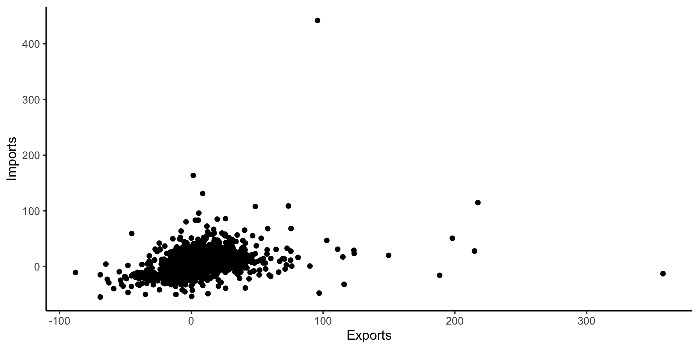

# R

For HW1, we will use data from the World Economic Outlook database, which includes information
about microeconomic data series for different country groups and countries from 2000
until 2025.

Load Libraries here.

```{r setup, include=FALSE}
library(ggplot2)
library(dplyr)
```


1. Load the dataset WEOOct2020data.csv. Check the structure and the summary of the data. Write few things about the dataset.

```{r}

```

2. Create a scaterplot of GDP.Per.capita and Uneployment. (0.5 point)

```{r}

```

3. Use faceting using Country.Groups (0.5 point)

```{r}

```


4. Create a scaterplot of GDP.Per.capita and Unemployment. Add a Regression line to the plot. (0.5 point)

```{r}

```

5. Use 3rd aesthetics as Region. What can you identify? (0.5 point)
```{r}

```


6. Calculate average GDP.Per.capita for each country. Then select the top 5 countries and visualize it using bar plot and then order the bars. (1 point)

```{r}

```

7. In this picture you can see the first 25 shapes. Try to visualize it the same way. (1 point)
```{r, echo = F, out.height='63%',out.width ='85%'}

```


8. In this example theme_classic() is used. Try to crate your own theme which will be similar to this theme. (1 point)

```{r, echo = F, out.height ='60%', out.width ='80%'}

```

# Python


Import libraries here

```{python}
import matplotlib.pyplot as plt
import pandas as pd
```

9. Read the WEOOct2020data.csv data. Specify parameter encoding ='latin1'. Check the structure and summary of the data. 

```{python}

```


10. Create a Scatterplot of Investments and Imports. What can you identify? (0.5 point)

```{python}

```

11. Create subplot with 4 axes. Do not forget to add suptiltles to the plot. (1 point)

* ax1 - scatterplot of Investments and Imports
* ax2 - scaterplot of GDP per capita and Unemployment
* ax3 - histogram of Imports
* ax4 - histogram of GDP per capita

```{python}

```


