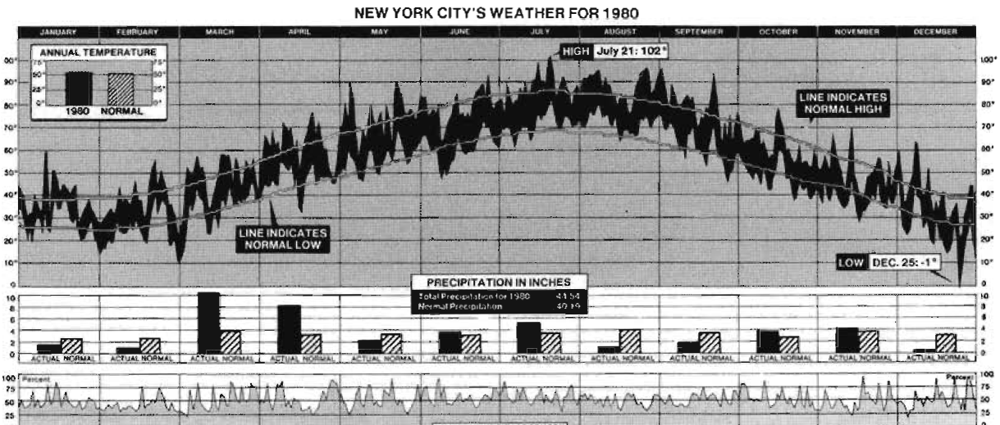
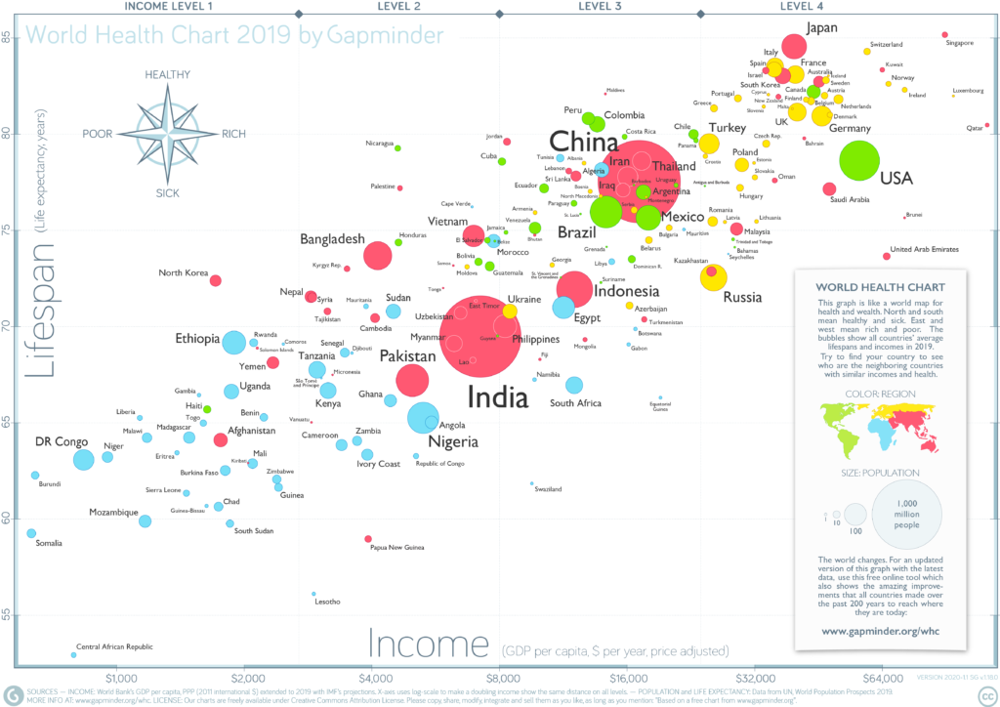

```{r setup, include=FALSE}
knitr::opts_chunk$set(echo = TRUE)
```

```{r, include = F}
options(scipen = 999)
library(dplyr)
library(ggplot2)
library(knitr)
library(dslabs)
```

# Assignmnet

A complex statistical graph can be considered a technological work of art, attracting the admiration of its viewers, remaining in their memory for years to come. With this assignment show pride in creating a visualization as beautiful and complex as a master. No limitations regarding the use of software.


## Visualization 1 (1 point)

The graph below represents a comprehensive picture of the weather in New York City in 1980 (New York Times January 11, 1981, p.32). The variables include daily measurements of actual normal temperature (high and low) and humidity, as well as monthly precipitation (actual and normal/average). The image can also be found in Edward Tufte's *The Visual Display of Quantitative Information*, p. 30.

Try to recreate the graph using the provided NYC weather dataset for 2015 fiscal year.

```{r, out.width='78%'}

```


## Visualization 2 (1 point)

Swedish physician/statistician's famous 2006 [TED talk](https://www.ted.com/talks/hans_rosling_the_best_stats_you_ve_ever_seen) debunked myths about the so-called “developing world” and has been viewed by millions. Hans Rosling's animated scatterplots convey surprising insights and are a huge eye-opener. The [link](http://ak.sbmu.ac.ir/uploads/Fact_Fullness_Hans_Rosling.pdf) to the online copy of the book.

Duplicate the World Health Chart (image below):

- Each bubble is a country. 
- The size of the bubble represents the country’s population
- The color of the bubble is geographical region
- On the x-axis is **GDP per capita**
- On the y-axis life expectancy. 

```{r,out.width='78%'}

```

As a source of data you can load the "gapminder" data from library(dslabs).

```{r, include=F}
library(gganimate)
library(png)
library(gifski)
```

```{r, include=F}
data(gapminder)

gdp_per_capita <- gapminder$gdp / gapminder$population
df <- cbind(gapminder, gdp_per_capita)
 
ggplot(df, aes(gdp_per_capita, life_expectancy, size = population, color = continent)) +
  geom_point() +
  # the commented lines add the name of the country to the bubble
  # while the names are present  in the reference picture, they make the graph not
  # easily observable
  # for that reason 2 versions of the graph are included
  # geom_text(aes(label=country), color="#000000", alpha=0.6) +
  # theme(legend.position = "none") +
  scale_color_manual(values=c("#77dff7", "#7feb00", "#ff5872", "#ffe700", "#ff5872")) +
  scale_size(range = c(2, 20)) +
  scale_x_log10() +
  theme_bw() +
  labs(title = 'Year: {frame_time}', x = 'Log GDP Per Capita', y = 'Life Expectancy') +
  transition_time(year) +
  ease_aes('linear')

anim_save("world_health_chart_no_names.gif")
```

```{r, include=F}
data(gapminder)

gdp_per_capita <- gapminder$gdp / gapminder$population
df <- cbind(gapminder, gdp_per_capita)
 
ggplot(df, aes(gdp_per_capita, life_expectancy, size = population, color = continent)) +
  geom_point() +
  geom_text(aes(label=country), color="#000000", alpha=0.6) +
  theme(legend.position = "none") +
  scale_color_manual(values=c("#77dff7", "#7feb00", "#ff5872", "#ffe700", "#ff5872")) +
  scale_size(range = c(2, 20)) +
  scale_x_log10() +
  theme_bw() +
  labs(title = 'Year: {frame_time}', x = 'Log GDP Per Capita', y = 'Life Expectancy') +
  transition_time(year) +
  ease_aes('linear')

anim_save("world_health_chart_with_names.gif")
```

## Visualization 3 (1 point)

Select one of the visualizations available on [informationisbeautiful website](https://informationisbeautiful.net/data/) and replicate it. 
The corresponding datasets are also available next to charts. Submit the data together with the HW.

Please elaborate on the following questions:

- What’s going on in this graph?
- Why do you believe it is a "good" visualization?

