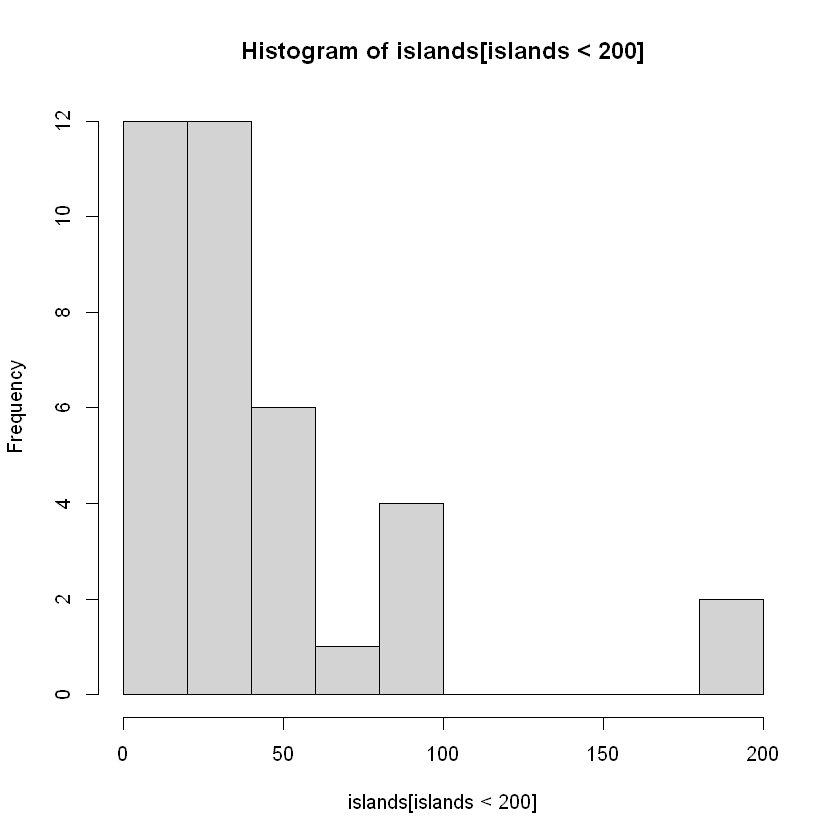
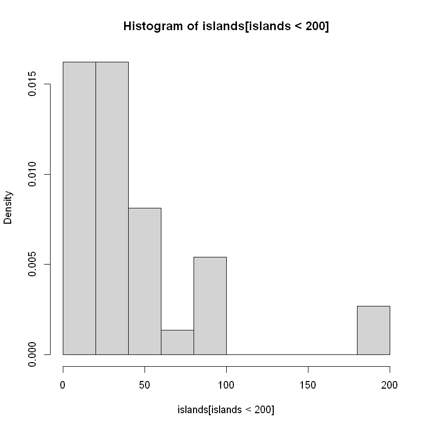
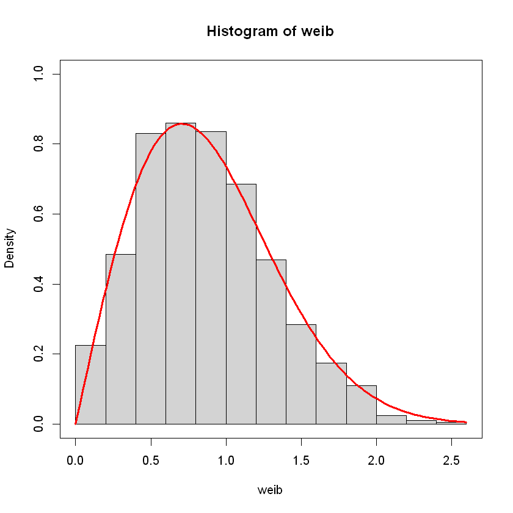
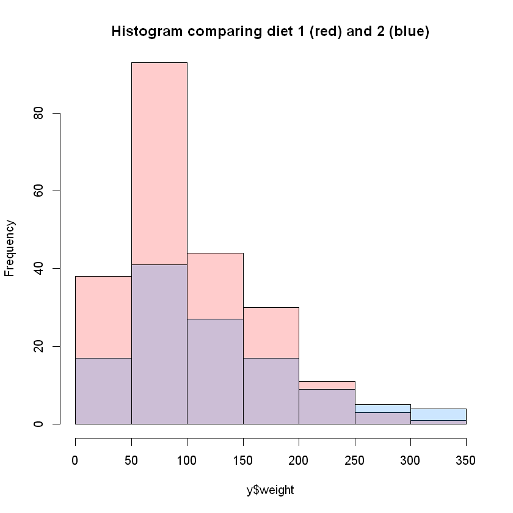
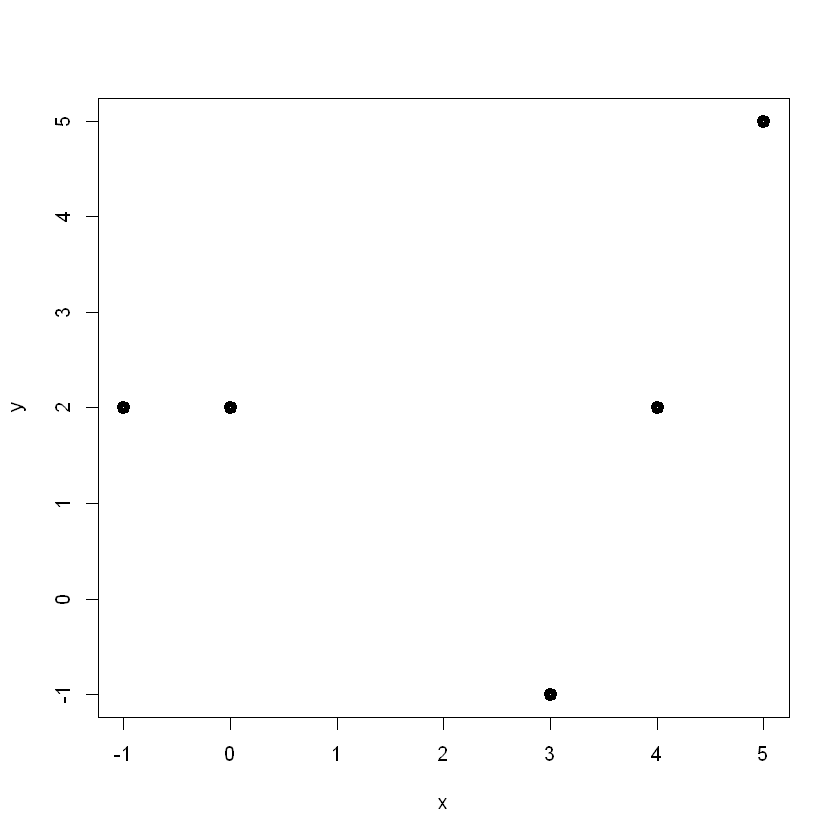
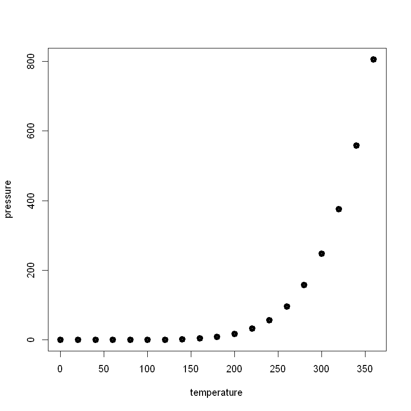
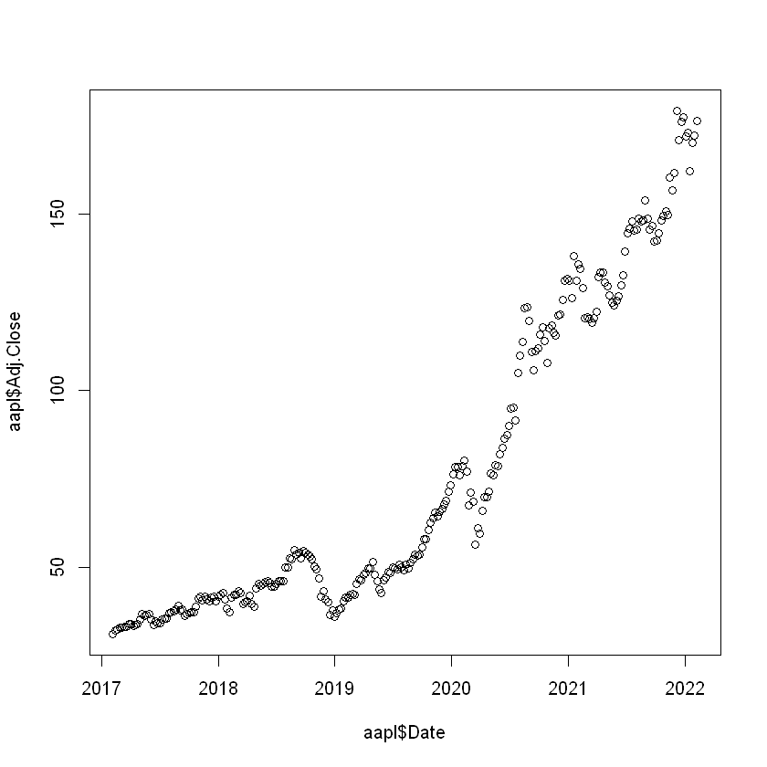
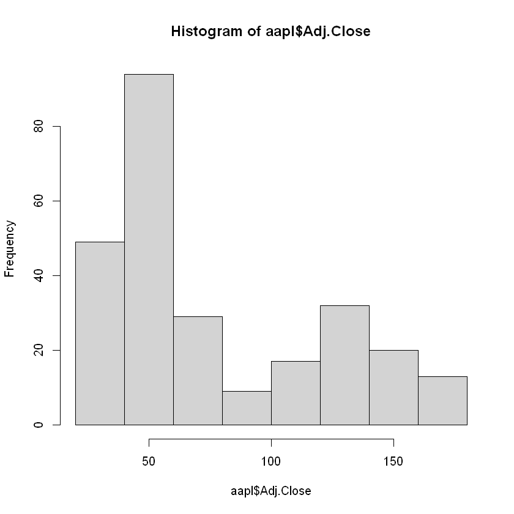

---
jupyter:
  kernelspec:
    display_name: R
    language: R
    name: ir
  language_info:
    codemirror_mode: r
    file_extension: .r
    mimetype: text/x-r-source
    name: R
    pygments_lexer: r
    version: 4.1.2
  nbformat: 4
  nbformat_minor: 2
  orig_nbformat: 4
---

::: {.cell .markdown}
# Homework 2

###### by Mher Movsisyan
:::

::: {.cell .markdown}
### Problem 1: Histograms (10 Points)
:::

::: {.cell .markdown}
Consider the following Dataset x:

    [1] 2.25 6.50 4.93 -2.09 4.66 3.89 -0.15 -1.51 7.48 0.28 0.03 3.16  
    [13] 4.03 2.53 5.58 2.22 7.48 -1.59 8.96 -1.55  

Break the range of x (or some interval containing the range) into 5
equal-length bins and construct 3 Histograms: Frequency, Relative
Frequency and Density.
:::

::: {.cell .markdown}
Sorting data:  
`-2.09 -1.55 -1.51 -0.15 0.03 0.28 2.22 2.25 2.53 3.16 3.89 4.03 4.66 4.93 5.58 5.89 6.5 7.48 8.96`
:::

::: {.cell .markdown}
Range: -2.09 to 8.96 (11.05)
:::

::: {.cell .markdown}
Bins:
$$ [-2.09, 0.12), [0.12, 2.33), [2.33, 4.54), [4.54, 6.75), [6.75, 8.96] $$
:::

::: {.cell .markdown}
    A   -2.09 -1.55 -1.51 -0.15 0.03 
    B    0.28  2.22  2.25 
    C    2.53  3.16  3.89  4.03 
    D    4.66  4.93  5.58  5.89 6.50 
    E    7.48  8.96

Constructing the Frequency Histogram:

  bin   Frequency   Rel. Frequency   Density
  ----- ----------- ---------------- ---------
  A     5           0.26             0.0239
  B     3           0.16             0.0144
  C     4           0.21             0.0191
  D     5           0.26             0.0239
  E     2           0.11             0.0096

``{=html}`</img>`{=html}
:::

::: {.cell .markdown}
### Problem 2: Measures of Central Tendency

a\. (10 Points)\
We are given the Dataset

    2, 2, 2, 5, 3, 2, 0, 0, 3, 5.

-   Find the 7-th Order Statistics of this Dataset.\
-   Calculate the Sample Mean, Median and Mode of this Dataset.\
-   Find the 25% Trimmed Mean of this Dataset.
:::

::: {.cell .markdown}
Sorting the data:

    0, 0, 2, 2, 2, 2, 3, 3, 5, 5
:::

::: {.cell .markdown}
7th order statistic is 3\
Mean = (2 \* 4 + 3 \* 2 + 5 \* 2) / 10 = 2.4\
Median = 2\
Mode = 2\
25% Trimmed Mean = (2 \* 4 + 3 \* 2) / 6 = 2.33
:::

::: {.cell .markdown}
b\. (6 Points)

-   Construct a Dataset x of size 6 with ̄x = −3 and median(x) = 5.\
    x = \[-46, 3, 4, 6, 7, 8\]
:::

::: {.cell .markdown}
-   (Supplementary) Construct a Dataset x of size 10 with ̄x = −3,
    median(x) = 5 and a mode(x) = 4.\
    x = \[-70, 4, 4, 4, 5, 5, 6, 7, 8, 9\]
:::

::: {.cell .markdown}
### Problem 3: Histograms
:::

::: {.cell .markdown}
a\. (R) (8 Points)\
Consider one of the standard Datasets in R, `islands`.

-   call the help page for this Dataset to see the description
:::

::: {.cell .code execution_count="5"}
``` {.R}
help(islands)
```

::: {.output .stream .stdout}
    islands                package:datasets                R Documentation

    _A_r_e_a_s _o_f _t_h_e _W_o_r_l_d'_s _M_a_j_o_r _L_a_n_d_m_a_s_s_e_s

    _D_e_s_c_r_i_p_t_i_o_n:

         The areas in thousands of square miles of the landmasses which
         exceed 10,000 square miles.

    _U_s_a_g_e:

         islands
         
    _F_o_r_m_a_t:

         A named vector of length 48.

    _S_o_u_r_c_e:

         The World Almanac and Book of Facts, 1975, page 406.

    _R_e_f_e_r_e_n_c_e_s:

         McNeil, D. R. (1977) _Interactive Data Analysis_.  Wiley.

    _E_x_a_m_p_l_e_s:

         require(graphics)
         dotchart(log(islands, 10),
            main = "islands data: log10(area) (log10(sq. miles))")
         dotchart(log(islands[order(islands)], 10),
            main = "islands data: log10(area) (log10(sq. miles))")
         
:::
:::

::: {.cell .markdown}
-   print the structure of the Dataset
:::

::: {.cell .code execution_count="14"}
``` {.R}
str(islands)
```

::: {.output .stream .stdout}
     Named num [1:48] 11506 5500 16988 2968 16 ...
     - attr(*, "names")= chr [1:48] "Africa" "Antarctica" "Asia" "Australia" ...
:::
:::

::: {.cell .markdown}
-   print the head of this Dataset
:::

::: {.cell .code execution_count="10"}
``` {.R}
print(head(islands))
```

::: {.output .stream .stdout}
          Africa   Antarctica         Asia    Australia Axel Heiberg       Baffin 
           11506         5500        16988         2968           16          184 
:::
:::

::: {.cell .markdown}
-   plot the Frequency Histogram for the islands with the area less than
    200,000 sq miles
:::

::: {.cell .code execution_count="24"}
``` {.R}
hist(islands[islands < 200])
```

::: {.output .display_data}
{height="420"
width="420"}
:::
:::

::: {.cell .markdown}
-   plot the Density Histogram for the islands with the area less than
    200,000 sq miles
:::

::: {.cell .code execution_count="25"}
``` {.R}
hist(islands[islands < 200], freq=F)
```

::: {.output .display_data}
{height="420"
width="420"}
:::
:::

::: {.cell .markdown}
b\. (R) (8 Points) Here we want to check that the Density Histogram is
approximating well the PDF behind the data. To that end, we consider the
Weibull distribution (see
[Wiki](https://en.wikipedia.org/wiki/Weibull_distribution)).

-   Take n = 1000
-   generate a sample of size n from the Weibull distribution with the
    shape parameter 2 (see rweibull and its parameters in R)
-   plot the Density Histogram of that sample, in cyan color
-   plot the theoretical PDF (use dweibull in R) over the previous
    graph, in red, and with linewidth 3.
:::

::: {.cell .code execution_count="9"}
``` {.R}
n <- 1000
weib <- rweibull(n, shape=2)

dweib <- function(x, shape, scale) {
  dweibull(x, 2, 1)
}

hist(weib, freq=F, xlim=c(0,2.6), ylim=c(0,1))
par(new=T)
plot(dweib, col="red", xlim=c(0,2.6), ylim=c(0,1), xlab="", ylab="", lwd=3)
```

::: {.output .display_data}
{height="420"
width="420"}
:::
:::

::: {.cell .markdown}
c\. (R) (8 Points)\
Now let's plot comparative Histograms. We will work with the R-s default
`ChickWeight` Dataset.

-   Explore the Dataset: read the description and print the first 5 rows
    of that Dataset;\
-   Separate in x the Weight variable for all Chicken with the Diet 1;\
-   Separate in y the Weight variable for all Chicken with the Diet 2;\
-   Calculate the Median of Weights for Chickens fed with the first
    diet;\
-   Calculate the difference between the Means of Weights for Chickens
    fed with the first and second diets;\
-   Plot the Frequency Histograms of x and y one over another. You can
    use transparent colors to make your graphs look nicer. For that, you
    can use the scales library's alpha command:\

```{=html}
<!-- -->
```
    library(scales)
    hist(x, col = alpha("magenta", 0.2))

This will draw a histogram of x with transparent magenta color.

-   What can be deduced from the Histograms?
:::

::: {.cell .code execution_count="8"}
``` {.R}
help(ChickWeight)
```

::: {.output .stream .stdout}
    ChickWeight              package:datasets              R Documentation

    _W_e_i_g_h_t _v_e_r_s_u_s _a_g_e _o_f _c_h_i_c_k_s _o_n _d_i_f_f_e_r_e_n_t _d_i_e_t_s

    _D_e_s_c_r_i_p_t_i_o_n:

         The 'ChickWeight' data frame has 578 rows and 4 columns from an
         experiment on the effect of diet on early growth of chicks.

    _U_s_a_g_e:

         ChickWeight
         
    _F_o_r_m_a_t:

         An object of class 'c("nfnGroupedData", "nfGroupedData",
         "groupedData", "data.frame")' containing the following columns:

         weight a numeric vector giving the body weight of the chick (gm).

         Time a numeric vector giving the number of days since birth when
              the measurement was made.

         Chick an ordered factor with levels '18' < ... < '48' giving a
              unique identifier for the chick.  The ordering of the levels
              groups chicks on the same diet together and orders them
              according to their final weight (lightest to heaviest) within
              diet.

         Diet a factor with levels 1, ..., 4 indicating which experimental
              diet the chick received.

    _D_e_t_a_i_l_s:

         The body weights of the chicks were measured at birth and every
         second day thereafter until day 20.  They were also measured on
         day 21.  There were four groups on chicks on different protein
         diets.

         This dataset was originally part of package 'nlme', and that has
         methods (including for '[', 'as.data.frame', 'plot' and 'print')
         for its grouped-data classes.

    _S_o_u_r_c_e:

         Crowder, M. and Hand, D. (1990), _Analysis of Repeated Measures_,
         Chapman and Hall (example 5.3)

         Hand, D. and Crowder, M. (1996), _Practical Longitudinal Data
         Analysis_, Chapman and Hall (table A.2)

         Pinheiro, J. C. and Bates, D. M. (2000) _Mixed-effects Models in S
         and S-PLUS_, Springer.

    _S_e_e _A_l_s_o:

         'SSlogis' for models fitted to this dataset.

    _E_x_a_m_p_l_e_s:

         require(graphics)
         coplot(weight ~ Time | Chick, data = ChickWeight,
                type = "b", show.given = FALSE)
         
:::
:::

::: {.cell .code execution_count="9"}
``` {.R}
head(ChickWeight)
```

::: {.output .display_data}
```{=html}
<table class="dataframe">
<caption>A nfnGroupedData: 6 × 4</caption>
<thead>
	<tr><th></th><th scope=col>weight</th><th scope=col>Time</th><th scope=col>Chick</th><th scope=col>Diet</th></tr>
	<tr><th></th><th scope=col>&lt;dbl&gt;</th><th scope=col>&lt;dbl&gt;</th><th scope=col>&lt;ord&gt;</th><th scope=col>&lt;fct&gt;</th></tr>
</thead>
<tbody>
	<tr><th scope=row>1</th><td>42</td><td> 0</td><td>1</td><td>1</td></tr>
	<tr><th scope=row>2</th><td>51</td><td> 2</td><td>1</td><td>1</td></tr>
	<tr><th scope=row>3</th><td>59</td><td> 4</td><td>1</td><td>1</td></tr>
	<tr><th scope=row>4</th><td>64</td><td> 6</td><td>1</td><td>1</td></tr>
	<tr><th scope=row>5</th><td>76</td><td> 8</td><td>1</td><td>1</td></tr>
	<tr><th scope=row>6</th><td>93</td><td>10</td><td>1</td><td>1</td></tr>
</tbody>
</table>
```
:::
:::

::: {.cell .code execution_count="32"}
``` {.R}
x <- ChickWeight[ChickWeight$Diet == 1,]
y <- ChickWeight[ChickWeight$Diet == 2,]
```
:::

::: {.cell .code execution_count="33"}
``` {.R}
median(x$weight)
```

::: {.output .display_data}
```{=html}
88
```
:::
:::

::: {.cell .code execution_count="34"}
``` {.R}
mean(x$weight) - mean(y$weight)
```

::: {.output .display_data}
```{=html}
-19.9712121212121
```
:::
:::

::: {.cell .code execution_count="47"}
``` {.R}
library(scales)
hist(x$weight, col=alpha("#ff0000", 0.2), xlim=c(0, 350), ylim=c(0, 90), ylab="", xlab="", main = "")
par(new=T)
hist(y$weight, col=alpha("#0084ff", 0.2), xlim=c(0, 350), ylim=c(0, 90), main="Histogram comparing diet 1 (red) and 2 (blue)")
```

::: {.output .display_data}
{height="420"
width="420"}
:::
:::

::: {.cell .markdown}
We can conclude that the weight of chickens following the 2nd diet has
higher variance, and the right tail is fatter (so are the chickens)
:::

::: {.cell .markdown}
### Problem 4: Scatterplot
:::

::: {.cell .markdown}
a\. (R) (5 Points)\
Plot the following points:\
$$ (0, 2),\ (3, −1),\ (4, 2),\ (5, 5),\ (−1, 2) $$
:::

::: {.cell .code execution_count="51"}
``` {.R}
x <- c(0, 3, 4, 5, -1)
y <- c(2, -1, 2, 5, 2)

plot(x, y, lwd = 5)
```

::: {.output .display_data}
{height="420"
width="420"}
:::
:::

::: {.cell .markdown}
b\. (R) (5 Points)\
R-s `pressure` Dataset consists of 2 Variables. Give the ScatterPlot of
these Variables.
:::

::: {.cell .code execution_count="53"}
``` {.R}
plot(pressure, lwd=5)
```

::: {.output .display_data}
{height="420"
width="420"}
:::
:::

::: {.cell .markdown}
### Problem 5: Apple Stock Weekly Returns Histogram (R)

(10 Points)
:::

::: {.cell .markdown}
Go to Yahoo Finance page, navigate to the Apple Stock page (Apple's
symbol (ticker) is AAPL, make a search for it), then choose Historical
Data, 5 years time period, and weekly frequency. Download that Data. It
will be in .csv format.

-   Using the R `read.csv` command, extract the Adjusted Close Prices
    ("Adj Close" column), calculate weekly returns of the Apple stock 1.

Note: To read a .csv file into a DataFrame, you can use the following:\
`aapl <- read.csv(file.choose())`\
Instead of `file.choose()` you can give the exact path of your
downloaded .csv file. But I prefer to have an Open dialog instead.

-   Plot the histogram of weekly returns;
-   Describe the results.
:::

::: {.cell .code execution_count="59"}
``` {.R}
aapl <- read.csv("https://query1.finance.yahoo.com/v7/finance/download/AAPL?period1=1486684800&period2=1644451200&interval=1wk&events=history&includeAdjustedClose=true")
aapl <− transform(aapl, Date=as.Date(as.character(Date),"%Y-%m-%d"))
```
:::

::: {.cell .code execution_count="60"}
``` {.R}
head(aapl)
```

::: {.output .display_data}
```{=html}
<table class="dataframe">
<caption>A data.frame: 6 × 7</caption>
<thead>
	<tr><th></th><th scope=col>Date</th><th scope=col>Open</th><th scope=col>High</th><th scope=col>Low</th><th scope=col>Close</th><th scope=col>Adj.Close</th><th scope=col>Volume</th></tr>
	<tr><th></th><th scope=col>&lt;date&gt;</th><th scope=col>&lt;dbl&gt;</th><th scope=col>&lt;dbl&gt;</th><th scope=col>&lt;dbl&gt;</th><th scope=col>&lt;dbl&gt;</th><th scope=col>&lt;dbl&gt;</th><th scope=col>&lt;int&gt;</th></tr>
</thead>
<tbody>
	<tr><th scope=row>1</th><td>2017-02-06</td><td>32.9125</td><td>33.2350</td><td>32.7800</td><td>33.0300</td><td>31.05098</td><td>193661600</td></tr>
	<tr><th scope=row>2</th><td>2017-02-13</td><td>33.2700</td><td>34.0675</td><td>33.1875</td><td>33.9300</td><td>32.03535</td><td>546670000</td></tr>
	<tr><th scope=row>3</th><td>2017-02-20</td><td>34.0575</td><td>34.3700</td><td>33.8200</td><td>34.1650</td><td>32.25722</td><td>351635600</td></tr>
	<tr><th scope=row>4</th><td>2017-02-27</td><td>34.2850</td><td>35.0700</td><td>34.0700</td><td>34.9450</td><td>32.99367</td><td>509896000</td></tr>
	<tr><th scope=row>5</th><td>2017-03-06</td><td>34.8425</td><td>34.9950</td><td>34.2625</td><td>34.7850</td><td>32.84261</td><td>398688800</td></tr>
	<tr><th scope=row>6</th><td>2017-03-13</td><td>34.7125</td><td>35.2550</td><td>34.7050</td><td>34.9975</td><td>33.04324</td><td>486158400</td></tr>
</tbody>
</table>
```
:::
:::

::: {.cell .code execution_count="63"}
``` {.R}
plot(aapl$Date, aapl$"Adj.Close")
```

::: {.output .display_data}
{height="420"
width="420"}
:::
:::

::: {.cell .code execution_count="64"}
``` {.R}
hist(aapl$"Adj.Close")
```

::: {.output .display_data}
{height="420"
width="420"}
:::
:::

::: {.cell .markdown}
Bimodal
:::
